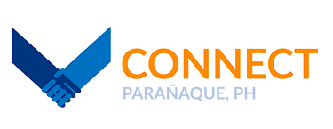
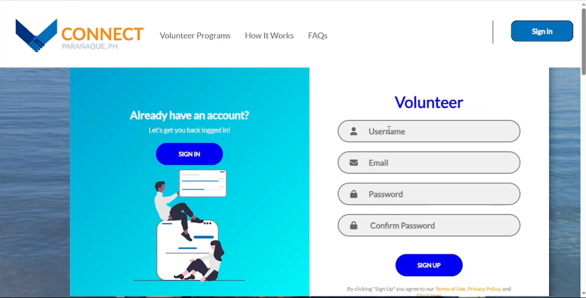
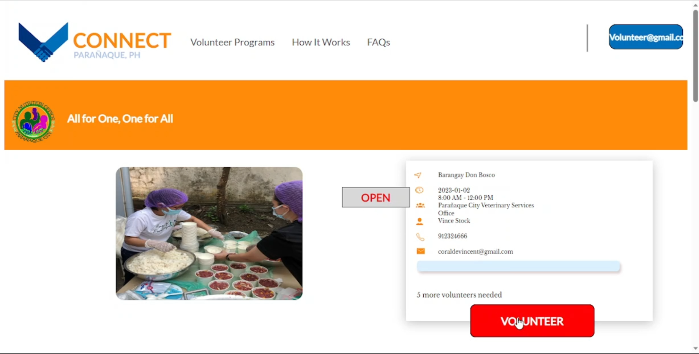
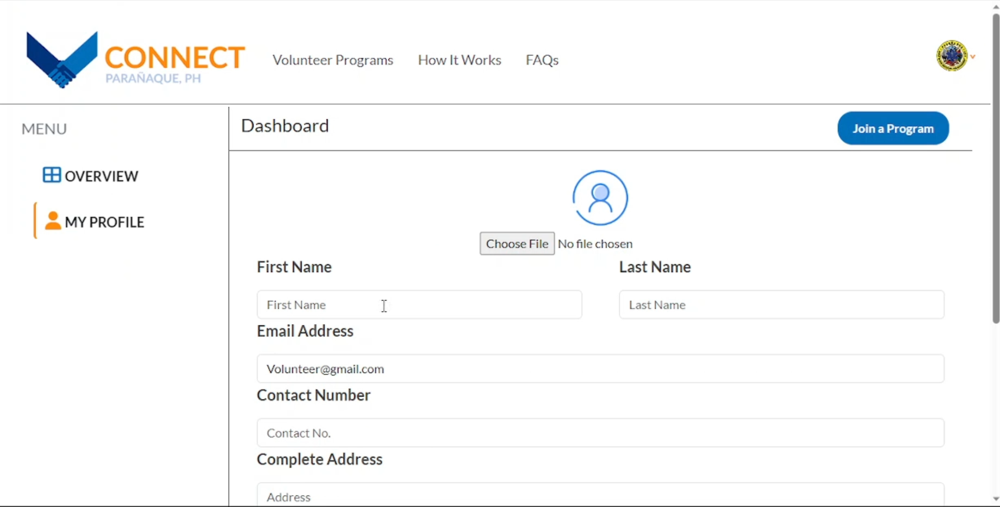
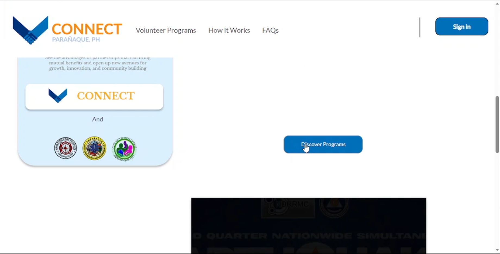
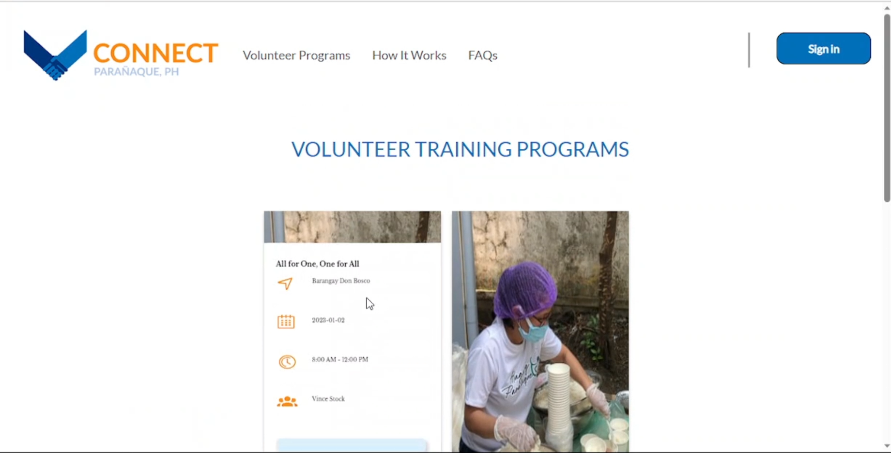
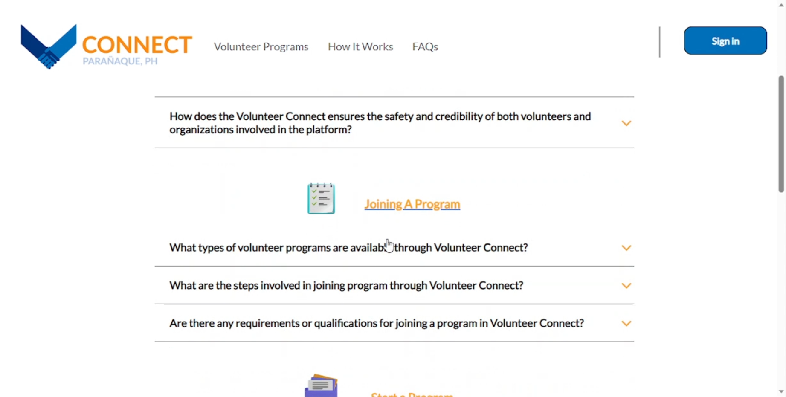
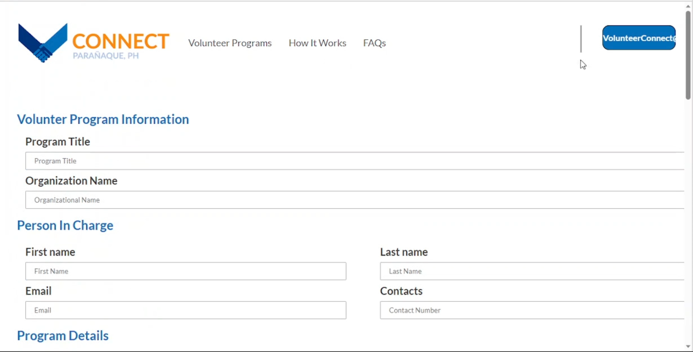

# Volunteer Connect

  

    
  

## 📌 Description

Volunteer Connect is a software system to improve volunteer management processes for social and civic welfare volunteer activities in the Paranaque City Area. The purpose of the website is to establish a centralized platform for volunteers and organizations to come together and collaborate on community service projects. The system will allow volunteers to search for volunteer program opportunities based on their desired interests and availability. It will include a user-friendly interface that will streamline the volunteer application process, allowing volunteers to apply for activities that resonate with them. The system will also authorize organizations to manage their program schedule and desired number of volunteers.

1. Registration of new users: Any user can access the application as a guest to enjoy the basic features provided, but registration is required to gain full access. The registration process is separated depending on the user type (volunteer, organization).
2. Authentication: Registered users can log in and manage their volunteer activity.
3. Event posting: organization users may publish volunteer events wherein interested volunteers may submit applications.
4. Participation in events: This is a direct method for volunteers to become involved in volunteer programs. Based on the information gathered, the organizations may accept or reject them.
5. Notifications: Volunteers will be notified about their upcoming program schedule and whether they were accepted or denied. Organizations will also be notified when an interested applicant registers for their program.

---

## 🖼️ Sign-up
  

    
  

## 🖼️ Home Page
  

    
  

## 🖼️ Volunteer Connect
  

    
    
    
    
    
    
  

  
---

## ✨ Significance

- Improves Volunteer Recruitment: Volunteer Connect provides a centralized platform to post opportunities and attract applicants specifically interested in the organization’s causes. This expands their volunteer pool.
- Increased Volunteer Participation: Volunteer Connect can make it easier for individuals to find volunteer opportunities that match their interests and skills. This can increase the number of volunteers participating in social and civic welfare activities in Parañaque City Area, leading to improved community engagement and social impact.
- Cost-Effective: Volunteer Connect can help organizations save money by reducing the need for traditional advertising and recruitment methods. With Volunteer Connect, organizations can post volunteer opportunities for free, reaching a wider audience without spending money on advertising.
- Improved User Experience: Volunteer Connect can provide a user-friendly and interactive platform for volunteers and organizations to connect and communicate. This can make the volunteer management process more efficient, productive, and enjoyable for everyone involved.
